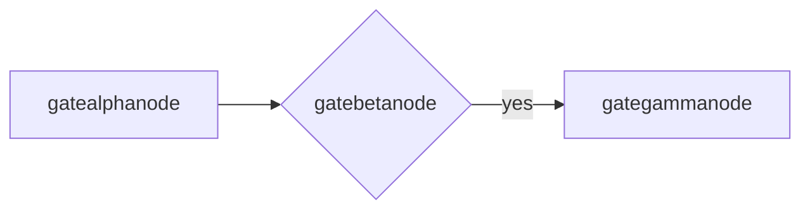
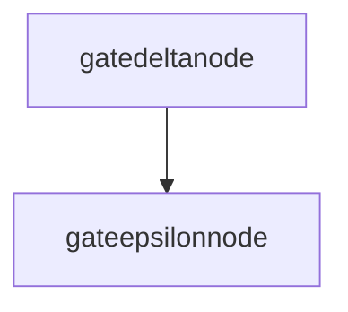
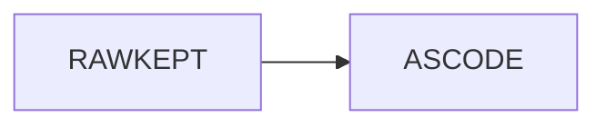
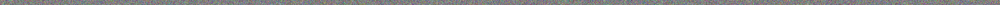

# Diagram Gate

A relative local image (CRITICAL regression: must render, not 404):


## First diagram



## Deliberately broken

```mermaid
graph LR
  A -->
  (((
```

## Second diagram (id-collision check)



## Kept as source




## Excalidraw scene

```excalidraw title="Converted flowchart"
{"type":"excalidraw","version":2,"source":"gstack-diagram-render","elements":[{"id":"VL7JRGkMTpqCVBye2mq3X","type":"rectangle","x":0,"y":0,"width":197.046875,"height":44,"angle":0,"strokeColor":"#1e1e1e","backgroundColor":"transparent","fillStyle":"solid","strokeWidth":2,"strokeStyle":"solid","roughness":1,"opacity":100,"groupIds":[],"frameId":null,"index":"a0","roundness":null,"seed":172328728,"version":3,"versionNonce":1118377320,"isDeleted":false,"boundElements":[{"type":"text","id":"mQsqVweT6BUmQpwbW6sOU"},{"id":"aVaLIsulCLlHiV1XqWi1-","type":"arrow"}],"updated":1781273248718,"link":null,"locked":false},{"id":"YX9Ff_UgFhhRa7lGo6xS9","type":"rectangle","x":247.046875,"y":0,"width":186.4375,"height":44,"angle":0,"strokeColor":"#1e1e1e","backgroundColor":"transparent","fillStyle":"solid","strokeWidth":2,"strokeStyle":"solid","roughness":1,"opacity":100,"groupIds":[],"frameId":null,"index":"a1","roundness":null,"seed":1275860584,"version":3,"versionNonce":45230184,"isDeleted":false,"boundElements":[{"type":"text","id":"9oes2DZoL-mRrT3RGakLq"},{"id":"aVaLIsulCLlHiV1XqWi1-","type":"arrow"}],"updated":1781273248718,"link":null,"locked":false},{"id":"aVaLIsulCLlHiV1XqWi1-","type":"arrow","x":197.047,"y":22,"width":44.70000000000002,"height":0,"angle":0,"strokeColor":"#1e1e1e","backgroundColor":"transparent","fillStyle":"solid","strokeWidth":2,"strokeStyle":"solid","roughness":1,"opacity":100,"groupIds":[],"frameId":null,"index":"a2","roundness":{"type":2},"seed":1530192920,"version":4,"versionNonce":1747670296,"isDeleted":false,"boundElements":null,"updated":1781273248718,"link":null,"locked":false,"points":[[0.5,0],[44.20000000000002,0]],"lastCommittedPoint":null,"startBinding":{"elementId":"VL7JRGkMTpqCVBye2mq3X","focus":0,"gap":1},"endBinding":{"elementId":"YX9Ff_UgFhhRa7lGo6xS9","focus":0,"gap":5.299874999999986},"startArrowhead":null,"endArrowhead":"arrow","elbowed":false},{"id":"mQsqVweT6BUmQpwbW6sOU","type":"text","x":33.5576171875,"y":9.5,"width":129.931640625,"height":25,"angle":0,"strokeColor":"#1e1e1e","backgroundColor":"transparent","fillStyle":"solid","strokeWidth":2,"strokeStyle":"solid","roughness":1,"opacity":100,"groupIds":[],"frameId":null,"index":"a3","roundness":null,"seed":1219280408,"version":3,"versionNonce":1462825496,"isDeleted":false,"boundElements":null,"updated":1781273248718,"link":null,"locked":false,"text":"excalialphanode","fontSize":20,"fontFamily":5,"textAlign":"center","verticalAlign":"middle","containerId":"VL7JRGkMTpqCVBye2mq3X","originalText":"excalialphanode","autoResize":true,"lineHeight":1.25},{"id":"9oes2DZoL-mRrT3RGakLq","type":"text","x":280.2998046875,"y":9.5,"width":119.931640625,"height":25,"angle":0,"strokeColor":"#1e1e1e","backgroundColor":"transparent","fillStyle":"solid","strokeWidth":2,"strokeStyle":"solid","roughness":1,"opacity":100,"groupIds":[],"frameId":null,"index":"a4","roundness":null,"seed":1436367640,"version":3,"versionNonce":639687528,"isDeleted":false,"boundElements":null,"updated":1781273248718,"link":null,"locked":false,"text":"excalibetanode","fontSize":20,"fontFamily":5,"textAlign":"center","verticalAlign":"middle","containerId":"YX9Ff_UgFhhRa7lGo6xS9","originalText":"excalibetanode","autoResize":true,"lineHeight":1.25}],"appState":{"viewBackgroundColor":"#ffffff"},"files":{}}
```

## Huge photo (downscale trigger, no diagram hint)



Done.
