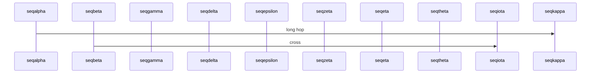
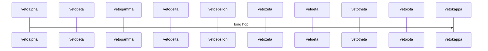

# Landscape Gate

Intro text under the first heading.

## Negative: screenshot stays portrait

## Positive: alt-hinted wide image promotes

## Positive: directive forces a small image

{page=landscape}

## Positive: wide diagram auto-promotes

## Negative: directive vetoes a wide diagram

Closing text.
