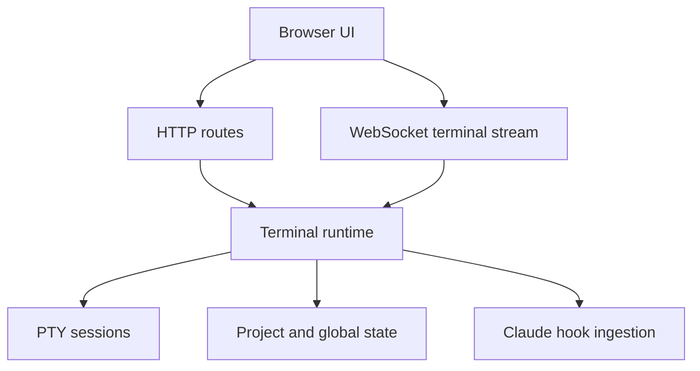

# Runtime And API

Octogent runs as a local API with a local web UI on top.

## Runtime shape

## Runtime responsibilities

The API process owns the moving parts that cannot live in markdown:

- terminal registry loading, migration, and persistence
- PTY lifecycle and scrollback
- WebSocket upgrades for terminal IO and terminal list events
- Claude hook installation and ingestion
- worktree creation and cleanup for isolated terminals
- transcript capture and conversation export
- in-memory channel queues
- Deck file operations over `.octogent/tentacles/`
- UI state persistence

## Transport model

- HTTP handles CRUD, snapshots, prompt resolution, setup checks, and file-backed operations
- `WS /api/terminals/:terminalId/ws` attaches a browser terminal to one PTY session
- `WS /api/terminal-events/ws` broadcasts terminal-created, terminal-updated, terminal-deleted, and state-change events
- file-backed state is the restart boundary for terminal records, UI state, transcripts, deck metadata, and monitor/cache data

Terminal WebSockets do not own the PTY. They are clients attached to a PTY session owned by the API process. When a browser reloads, a new WebSocket can receive scrollback during the idle grace window. When the API restarts, the PTY is gone.

## Security defaults

- binds to `127.0.0.1` by default
- enforces loopback `Host` and `Origin` checks by default
- remote access must be enabled explicitly with `OCTOGENT_ALLOW_REMOTE_ACCESS=1`

## Persistence model

- project-local scaffold lives under `.octogent/`
- runtime state lives under `~/.octogent/projects/<project-id>/state/`
- transcript events persist independently from PTY scrollback
- PTY sessions do not survive API restarts
- terminal records persisted as `running` are reconciled to `stale` on startup when no live Octogent session owns them

The terminal registry is `tentacles.json` for historical reasons. Current records are terminals, not tentacles. A terminal record stores identity, tentacle ID, optional worktree ID, parent terminal ID, workspace mode, display name, lifecycle fields, and UI-related metadata.

Deck metadata is separate from tentacle markdown. `deck.json` stores display/status details that should not be mixed into `CONTEXT.md` or `todo.md`.

## Terminal lifecycle

Creating a terminal writes a registry record first. If an initial prompt is provided, the runtime immediately starts a PTY session. Otherwise, the PTY starts when a WebSocket or direct listener attaches.

When a PTY starts, Octogent:

1. resolves the working directory from the terminal workspace mode
2. spawns the user's shell through `node-pty`
3. injects the configured agent bootstrap command
4. optionally pastes and submits an initial prompt
5. writes transcript events and keeps bounded scrollback in memory
6. broadcasts state updates to attached clients

Stopping or killing a terminal tears down the active PTY and updates lifecycle metadata. Deleting a terminal also cascades to child terminals and removes worktrees for worktree-backed records.

## Hook mechanism

For Claude-backed terminals, Octogent writes hooks into the target `.claude/settings.json`. The hooks call back into the local API and provide state transitions that terminal output alone cannot reliably express.

Hooks currently feed these mechanisms:

- `UserPromptSubmit` marks the terminal active and can auto-name generated terminals from the first prompt
- `PreToolUse` records the current tool and marks user-question waits
- `Notification` marks permission waits and idle prompts
- `Stop` parses Claude transcript data into stored conversations and releases the idle keep-alive
- `PostToolUse` for `Edit|Write` feeds code-intel events

Channel delivery is also tied to hooks. Messages are queued in memory and injected when a target session is idle, including after idle or stop hook events.

## Main API groups

- terminals and snapshots
- deck tentacles and todo operations
- prompts
- channels
- code intel
- hook ingestion
- usage and telemetry
- monitor
- conversations

For the exact endpoints, see [API reference](../reference/api.md).
